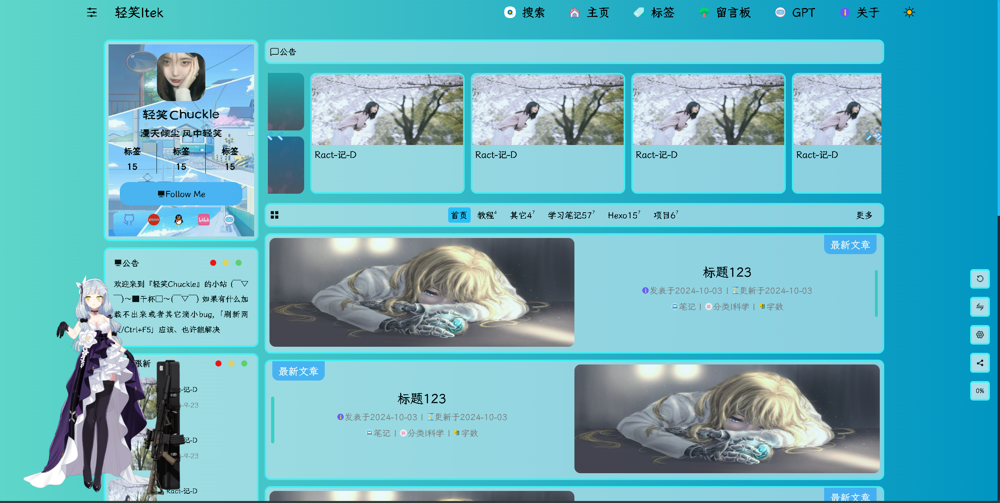
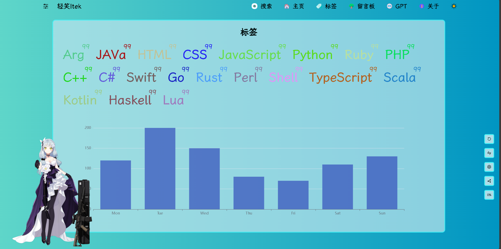
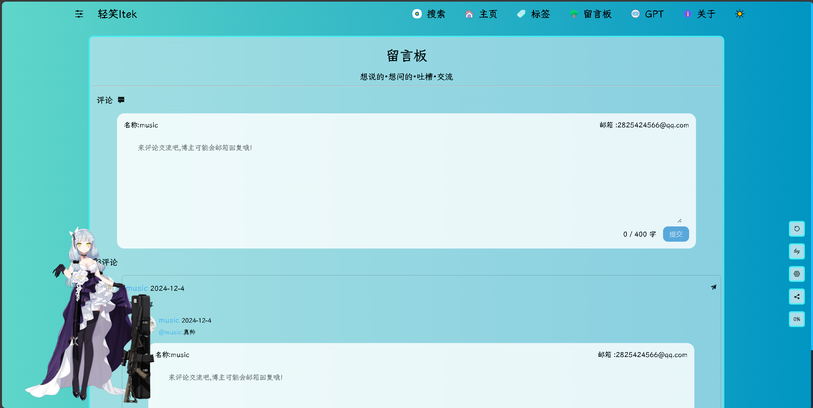
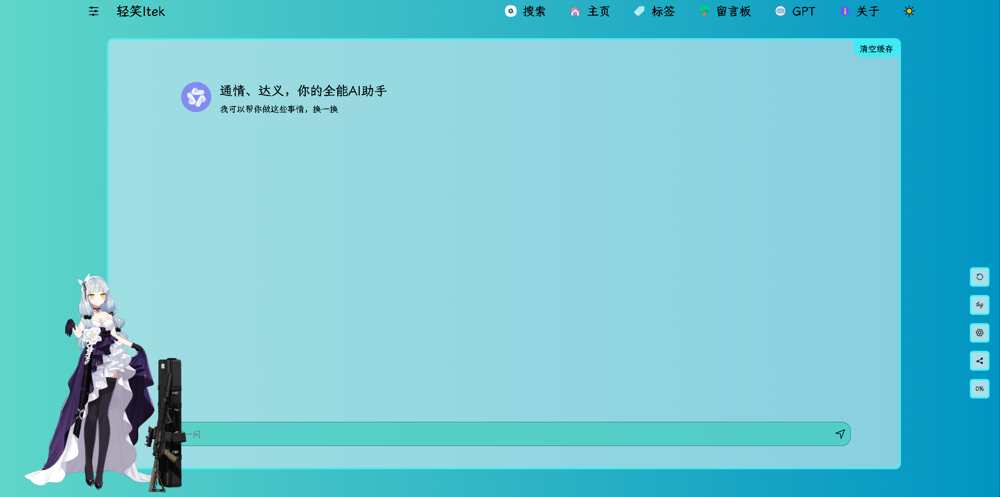
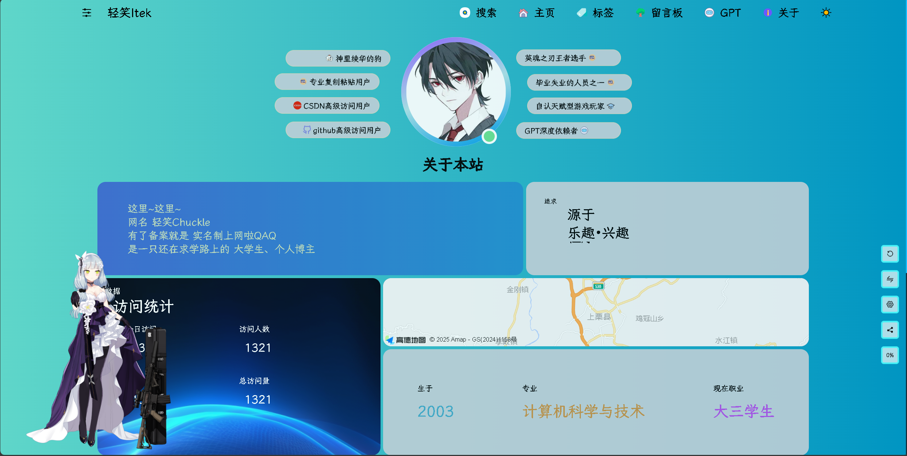

# 前端 check_vue
##Vue 3 + TypeScript + Vite
https://musicbklog.pages.dev /(个人博客)
https://www.qcqx.cn/
## 使用库
##Axios

- yarn add axios
- yarn add path-browserify

##El组件

- yarn add element-plus
- yarn add -D unplugin-vue-components unplugin-auto-import

##El图标库

```全局注册```
##图片懒加载

- npm install vue-lazyload

##Router

- yarn add vue-router

##[markdown]

- npm install markdown-it

##看板娘

- yarn add oh-my-live2d

##Sess

- yarn add sass --dev

##可视化

- npm install @jiaminghi/data-view

## 路由
`首页`


`标签`




`问问`



`留言`



`关于`




# 后端 


